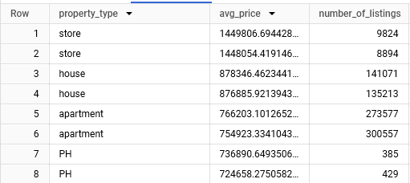

### 1) Counting Projects per City
DESCRIPTION: count number of projects in a city

Non Optimized: If data sets are extremely large because it processes all the rows, groups them by cities, and then orders the results. Since sorting is done after grouping it can be slower
```
SELECT proj_city, COUNT(*) AS project_count
FROM `bigquery-public-data.sdoh_hud_housing.2017_lihtc_database_hud`
GROUP BY proj_city
ORDER BY project_count DESC
LIMIT 10;
```


Optimzed
    With clause helps readability and also helps with pre filtering rather than having to process the entire table in the final results 
```
WITH project_counts AS (
  SELECT proj_cty, COUNT(*) AS project_count
  FROM `bigquery-public-data.sdoh_hud_housing.2017_lihtc_database_hud`
  GROUP BY proj_cty
)
SELECT proj_cty, project_count
FROM project_counts
ORDER BY project_count DESC
LIMIT 20;

```


### 2) Top Housing Projects in Cities with Over 50 Projects, Sorted by Allocation Amount
Description: This query retrieves detailed information about housing projects in cities that have more than 50 projects. It joins data from the 2017 Low-Income Housing Tax Credit (LIHTC) database and filters out cities with fewer than 50 projects. The results include the project name, city, state, ZIP code, allocation amount, and contact information, sorted by the allocation amount in descending orde

Non-Optimzied 
    The aggregation is performed on the fly within the JOIN clause, meaning that BigQuery will have to compute the COUNT(*) for all the rows in the main table before performing the join
```
SELECT p.project, p.proj_cty, p.proj_st, p.proj_zip, p.allocamt, p.contact
FROM `bigquery-public-data.sdoh_hud_housing.2017_lihtc_database_hud` p
JOIN (
  SELECT proj_cty, COUNT(*) AS project_count
  FROM `bigquery-public-data.sdoh_hud_housing.2017_lihtc_database_hud`
  GROUP BY proj_cty
  HAVING project_count > 50
) c ON p.proj_cty = c.proj_cty
ORDER BY p.allocamt DESC;
```
OPTIMIZED 
    CTE allows us to compute the project counts first, filtering out cities with fewer than 50 projects before joining. This reduces the data
```
WITH CityProjectCount AS (
  SELECT proj_cty, COUNT(*) AS project_count
  FROM `bigquery-public-data.sdoh_hud_housing.2017_lihtc_database_hud`
  GROUP BY proj_cty
  HAVING project_count > 50
)
SELECT p.project, p.proj_cty, p.proj_st, p.proj_zip, p.allocamt, p.contact
FROM `bigquery-public-data.sdoh_hud_housing.2017_lihtc_database_hud` p
JOIN CityProjectCount c ON p.proj_cty = c.proj_cty
ORDER BY p.allocamt DESC;

```



### 3) Query to List Projects with the Most Low-Income Units in Each State

Description: List of projects with the most low income units by each state


non Optimized
    The subquery (SELECT MAX(li_units)) is executed for each row, meaning for every row in the outer query, it recalculates the maximum number of low-income units for that particular state (proj_st). This is redudant.
```
SELECT p.proj_st, p.proj_cty, p.proj_zip, p.li_units, p.contact
FROM `bigquery-public-data.sdoh_hud_housing.2017_lihtc_database_hud` p
WHERE p.li_units = (
  SELECT MAX(li_units)
  FROM `bigquery-public-data.sdoh_hud_housing.2017_lihtc_database_hud`
  WHERE proj_st = p.proj_st
)
ORDER BY p.proj_st;
```

Optimzed 
    The CTE (MaxLowIncomeUnits) calculates the maximum number of low-income units (MAX(li_units)) for each state (proj_st) in one pass, which is more efficient than recalculating it for every row.
    The JOIN then brings in the relevant data from the main table (2017_lihtc_database_hud) by matching states (proj_st) and the maximum number of low-income units for that state
```
WITH MaxLowIncomeUnits AS (
  SELECT proj_st, MAX(li_units) AS max_low_income_units
  FROM `bigquery-public-data.sdoh_hud_housing.2017_lihtc_database_hud`
  GROUP BY proj_st
)
SELECT p.proj_st, p.proj_cty, p.proj_zip, p.li_units, p.contact
FROM `bigquery-public-data.sdoh_hud_housing.2017_lihtc_database_hud` p
JOIN MaxLowIncomeUnits m ON p.proj_st = m.proj_st AND p.li_units = m.max_low_income_units
ORDER BY p.proj_st;

```

